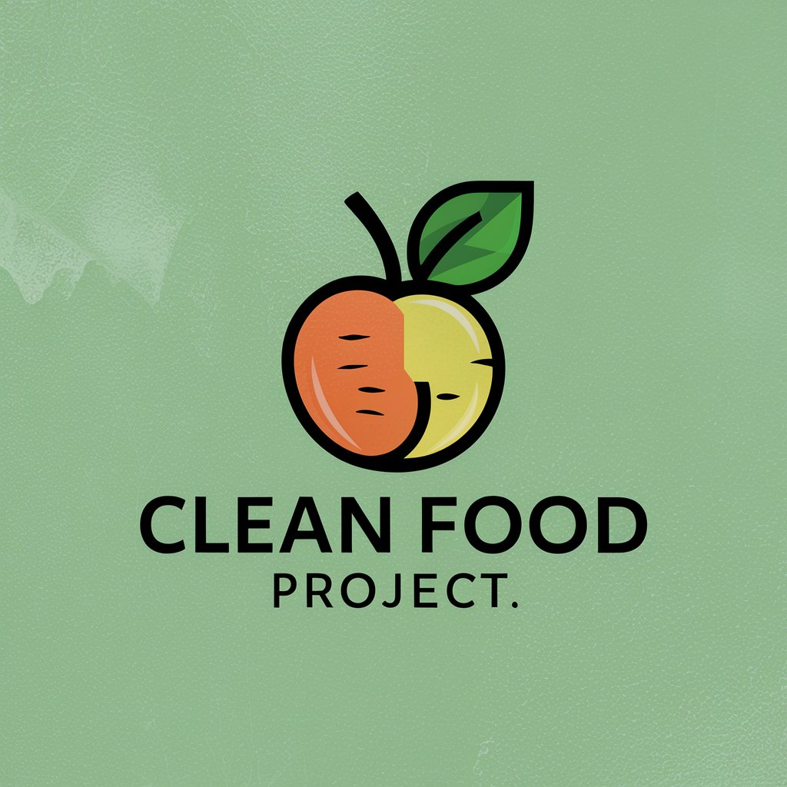
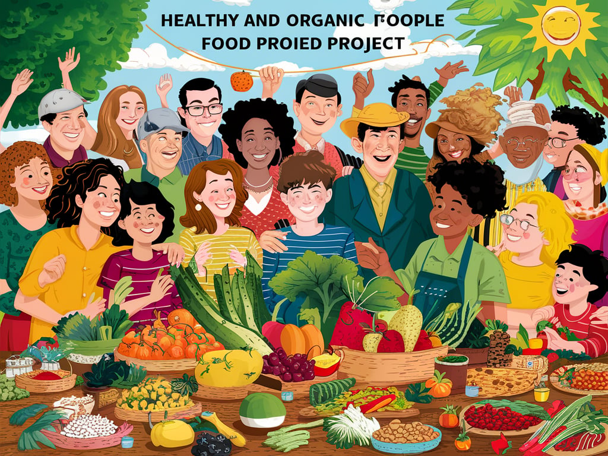
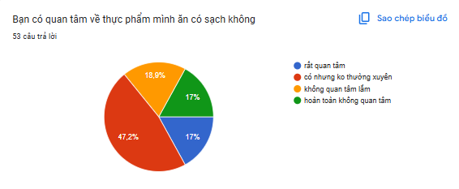
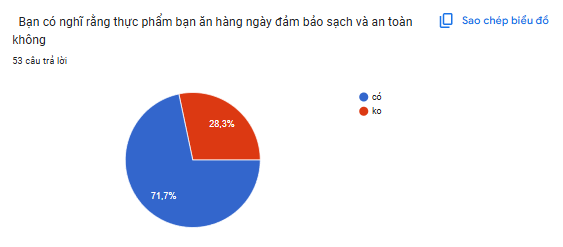
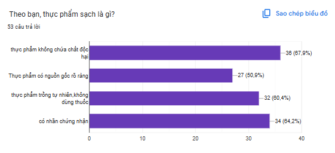
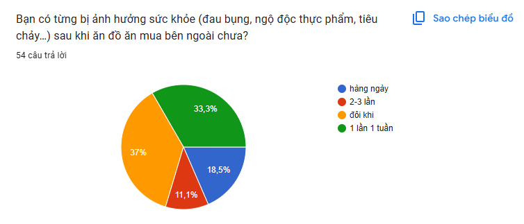
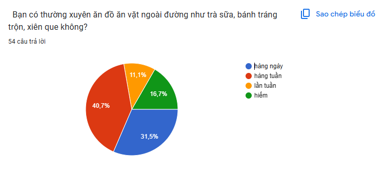
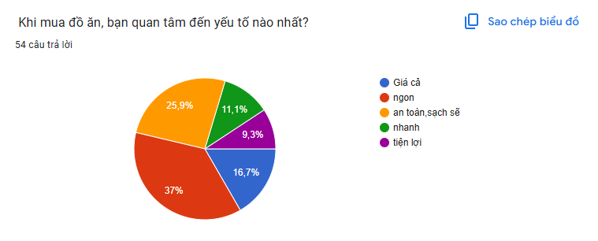
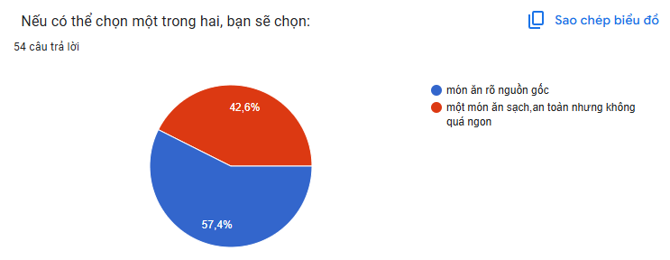

<!DOCTYPE html>
<html lang="vi">
<head>
    <meta name="viewport" content="width=device-width, initial-scale=1">
    <title>An Toàn Thực Phẩm</title>
    
</head>
<body>
    

        
        
An Toàn Thực Phẩm

    

    

        
        

            <h2>Lời nói đầu</h2>
            
<i>Trong thời đại ngày nay, vấn đề an toàn thực phẩm đang trở thành mối quan tâm hàng đầu của cộng đồng, đặc biệt là đối với học sinh – những thế hệ tương lai của đất nước...</i>

            

        

    

    

    <h1 class="kq">Nhận Thức</h1>
    

        

            
        

        

            <h2>Nguyên nhân</h2>
            
Thực phẩm bẩn tràn lan

            
Thiếu nhận thức về thực phẩm sạch

            
Học sinh ít cơ hội tiếp xúc với quá trình chăm sóc cây

            
Môi trường học đường là nơi phù hợp để thực hiện

            
Bảo vệ môi trường
   
        

        

            
        

    

    

        

            
        

        

            <h2>Vấn đề</h2>
            
Kết quả khảo sát cho thấy nhiều học sinh vẫn gặp vấn đề với thực phẩm không an toàn...

        

        

            
        

    

    

        
        
        
    

    

        

            
        

        

            <h2>Thói quen</h2>
            
Kết quả khảo sát cho thấy khi phải lựa chọn giữa một món ăn rõ nguồn gốc và một món ăn sạch nhưng không quá ngon...

        

    

    

</body>
</html>
